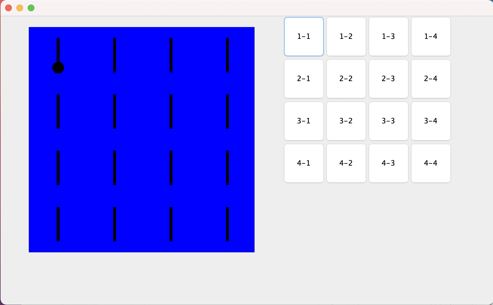
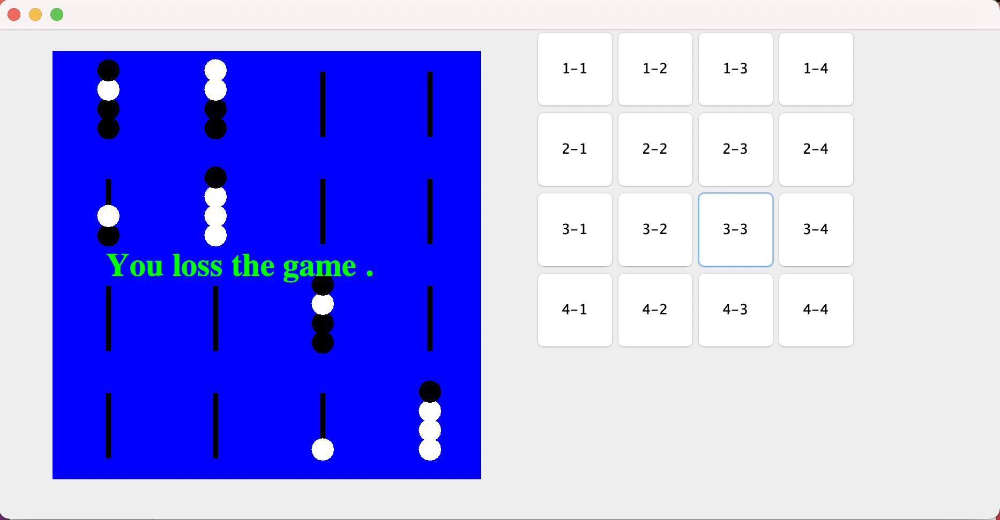

# Score-4-Game

**Score Four is a "three dimensional" abstract strategy game, similar to Connect Four.**

<h2>Functionality</h2>
<p>The object of Score Four is to position four beads of the same color in a straight line on any level or any angle. As in Tic Tac Toe, Score Four strategy centers around forcing a win by making multiple threats simultaneously, while preventing the opponent from doing so. On the 4×4×4 board, there are 76 winning lines.</p>

<h2>Installations</h2>

```
Download the Code
```
<li>How to Run</li>

```
javac Main.java
```
```
java Main
```

<h2>ScreenShots & SnapShots</h2>


<h4><li> Home Screen</li> </h4>



<h4><li> User v/s AI </li> </h4>


